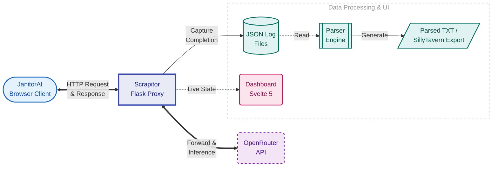

<p align="center">
  
</p>

<h1 align="center">Scrapitor</h1>

<p align="center">
  <strong>Intercept. Parse. Export.</strong>
</p>

<p align="center">
  
  
  
  
</p>

---

A local proxy that intercepts JanitorAI traffic, captures request payloads as JSON logs, and provides a rule-driven parser to extract clean character sheets. Exports to SillyTavern-compatible JSON format.

## Quick Start (Windows)

```
1. Download: https://github.com/daksh-7/Scrapitor → Code → Download ZIP → Unzip
2. Run: Double-click run.bat
3. Copy the Cloudflare Proxy URL from the terminal
4. In JanitorAI: Enable "Using proxy" → paste the URL → add your OpenRouter API key
5. Send a message — your request appears in the dashboard Activity tab
```

**Requirements:** Python 3.10+ and PowerShell 7. The launcher auto-installs everything else.

---

## Table of Contents

- [Architecture](#architecture)
- [Installation](#installation)
- [Configuring JanitorAI](#configuring-janitorai)
- [Web Dashboard](#web-dashboard)
- [Parser System](#parser-system)
- [CLI Usage](#cli-usage)
- [API Reference](#api-reference)
- [Configuration](#configuration)
- [Docker](#docker)
- [Troubleshooting](#troubleshooting)
- [Development](#development)

---

## Architecture



**Data Flow:**

1. JanitorAI sends chat requests to the Scrapitor proxy (via Cloudflare tunnel)
2. Scrapitor logs the full request payload as JSON, then forwards to OpenRouter
3. The parser extracts character data using tag-aware rules
4. Parsed content is saved as versioned `.txt` files or exported to SillyTavern JSON

---

## Installation

### Windows (Recommended)

**Prerequisites:**
- Python 3.10+ ([Download](https://www.python.org/downloads/) — check "Add python.exe to PATH")
- PowerShell 7: `winget install Microsoft.PowerShell`

**Install:**
```powershell
# Option A: Download ZIP from GitHub and unzip

# Option B: Clone with Git
git clone https://github.com/daksh-7/Scrapitor
cd Scrapitor
```

**Then:** Double-click run.bat

The launcher will:
- Create a virtual environment and install dependencies
- Build the Svelte frontend (if Node.js is available and sources changed)
- Start Flask on port 5000
- Establish a Cloudflare tunnel and display the public URL
- Show live status (press Q to quit)

```
███████╗ ██████╗██████╗  █████╗ ██████╗ ██╗████████╗ ██████╗ ██████╗
██╔════╝██╔════╝██╔══██╗██╔══██╗██╔══██╗██║╚══██╔══╝██╔═══██╗██╔══██╗
███████╗██║     ██████╔╝███████║██████╔╝██║   ██║   ██║   ██║██████╔╝
╚════██║██║     ██╔══██╗██╔══██║██╔═══╝ ██║   ██║   ██║   ██║██╔══██╗
███████║╚██████╗██║  ██║██║  ██║██║     ██║   ██║   ╚██████╔╝██║  ██║
╚══════╝ ╚═════╝╚═╝  ╚═╝╚═╝  ╚═╝╚═╝     ╚═╝   ╚═╝    ╚═════╝ ╚═╝  ╚═╝

  [✓] Python 3.12.0 found
  [✓] Dependencies up to date
  [✓] Cloudflared ready
  [✓] Flask healthy on :5000
  [✓] Tunnel ready

  ┌────────────────────────────────────────────────────────────────┐
  │  Dashboard:  http://localhost:5000                             │
  │  LAN:        http://192.168.0.101:5000                         │
  │  Proxy URL:  https://example.trycloudflare.com/openrouter-cc   │
  └────────────────────────────────────────────────────────────────┘
```

### macOS / Linux

```bash
# Clone and setup
git clone https://github.com/daksh-7/Scrapitor && cd Scrapitor

# Create venv and install deps
python3 -m venv app/.venv
source app/.venv/bin/activate
pip install -r app/requirements.txt

# Build frontend (requires Node.js 18+)
cd frontend && npm install && npm run build && cd ..

# Run server
python -m app.server

# In another terminal: start tunnel (optional)
cloudflared tunnel --no-autoupdate --url http://127.0.0.1:5000
```

---

## Configuring JanitorAI

1. Open a character chat in JanitorAI
2. Click **"using proxy"** and create a new proxy configuration
3. Set **Model name** to: `mistralai/devstral-2512:free`
4. Set **Proxy URL** to your Cloudflare endpoint (ends with `/openrouter-cc`)
5. Set **API Key** to your [OpenRouter API key](https://openrouter.ai/keys)
6. Click **Save changes**, then **Save Settings**, and refresh the page
7. Send a test message to verify the connection

---

## Web Dashboard

Access the dashboard at:
- **Localhost:** `http://localhost:5000` — from the same machine
- **LAN:** `http://<your-ip>:5000` — from any device on your network (phones, tablets, other computers)
- **Cloudflare:** Your tunnel URL — from anywhere on the internet

### Overview
- **Metrics:** Request count, log files, parsed outputs, server port
- **Endpoints:** Copy model name, Cloudflare URL, and local URL
- **Quick Start:** Step-by-step JanitorAI setup guide

### Parser
- **Modes:**
  - **Default:** Outputs all character content, Scenario, and First Message (no filtering)
  - **Custom:** Fine-grained control with Include/Exclude tag sets
- **Tag Chips:** Click to toggle between Include and Exclude states
- **Detect Tags:** Scan logs to discover available tags
- **Write:** Generate versioned `.txt` outputs for latest or selected logs
- **Export:** Create SillyTavern-compatible JSON (chara_card_v3 spec)

### Activity
- Browse captured request logs (newest first)
- Open raw JSON or rename log files inline
- View parsed TXT versions with a version picker
- Multi-select logs/parsed files for batch export to SillyTavern

---

## Parser System

The parser extracts structured character data from JanitorAI request payloads.

### Extraction Rules

1. **Newlines:** Replace literal `\n` sequences with actual newlines
2. **System Message:** Extract from the first message with `role: "system"`
3. **Character Name:** First opening tag that isn't `system`, `scenario`, `example_dialogs`, `persona`, or `userpersona`
4. **Character Content:** Inner text of the character tag block
5. **Scenario:** `<Scenario>...</Scenario>` block (if outside the character block)
6. **First Message:** First `assistant` message content
7. **Untagged Content:** Any text outside recognized tag blocks

### Filtering Modes

| Mode | Behavior |
|------|----------|
| **Default** | Output everything (no filtering) |
| **Custom + Include** | Only output explicitly included tags/sections |
| **Custom + Exclude** | Output everything except excluded tags |

**Special Include Tags:**
- Character name (e.g., `miku`) — include the character block
- `scenario` — include the Scenario section
- `first_message` — include the First Message
- `untagged content` — include text outside tag blocks

### Version Control

Each write creates a new versioned file: `<Character Name>.v1.txt`, `.v2.txt`, etc.
Versions are stored in `app/var/logs/parsed/<json_stem>/`.

---

## CLI Usage

```bash
# Default parse (no filtering)
python app/parser/parser.py path/to/log.json

# Omit tags (blacklist)
python app/parser/parser.py --preset custom --omit-tags scenario,persona log.json

# Include only selected tags (whitelist)
python app/parser/parser.py --preset custom --include-tags miku,scenario,first_message log.json

# Strip tag markers but keep content
python app/parser/parser.py --preset custom --strip-tags scenario log.json

# Control output location and versioning
python app/parser/parser.py --output-dir out --suffix v2 log.json
```

---

## API Reference

### Proxy Endpoints

| Method | Path | Description |
|--------|------|-------------|
| GET | `/openrouter-cc` | Proxy status and version info |
| POST | `/openrouter-cc` | Forward chat completion to OpenRouter (supports streaming) |
| POST | `/chat/completions` | Alias for `/openrouter-cc` |
| GET | `/models` | Minimal model list for compatibility |

### Log Endpoints

| Method | Path | Description |
|--------|------|-------------|
| GET | `/logs` | List recent logs with metadata |
| GET | `/logs/<name>` | Get raw JSON log content |
| POST | `/logs/<name>/rename` | Rename a log file |
| POST | `/logs/delete` | Delete log files (and their parsed directories) |
| GET | `/logs/<name>/parsed` | List parsed TXT versions |
| GET | `/logs/<name>/parsed/<file>` | Get parsed TXT content |
| POST | `/logs/<name>/parsed/rename` | Rename a parsed file |
| POST | `/logs/<name>/parsed/delete` | Delete parsed files |

### Parser Endpoints

| Method | Path | Description |
|--------|------|-------------|
| GET/POST | `/parser-settings` | Get or update parser mode and tag lists |
| POST | `/parser-rewrite` | Rewrite parsed outputs for logs |
| GET | `/parser-tags` | Detect tags from log(s) |
| POST | `/export-sillytavern` | Export to SillyTavern JSON |

### System Endpoints

| Method | Path | Description |
|--------|------|-------------|
| GET | `/tunnel` | Get Cloudflare tunnel URL |
| GET | `/health` | Health check with uptime |
| GET/POST | `/param` | View/update generation defaults |

---

## Configuration

Configuration can be set via:
1. **Environment variables** (highest priority)
2. **`.env` file** at the repo root
3. **`config.yaml`** file (for port only)

### Example `.env` file

```bash
# Create a .env file in the Scrapitor root folder
PROXY_PORT=8080
OPENROUTER_API_KEY=sk-or-v1-xxxxx
LOG_LEVEL=DEBUG
```

### Available Variables

| Variable | Default | Description |
|----------|---------|-------------|
| `PROXY_PORT` | `5000` | Flask server port |
| `OPENROUTER_URL` | `https://openrouter.ai/api/v1/chat/completions` | Upstream API |
| `OPENROUTER_API_KEY` | *(empty)* | Server-side API key (optional) |
| `ALLOW_SERVER_API_KEY` | `false` | Allow using server-side key |
| `ALLOWED_ORIGINS` | `*` | CORS origins (comma-separated) |
| `LOG_DIR` | `var/logs` | Log storage directory |
| `MAX_LOG_FILES` | `1000` | Max logs before pruning oldest |
| `LOG_LEVEL` | `INFO` | Python logging level |
| `CONNECT_TIMEOUT` | `5.0` | Upstream connect timeout (seconds) |
| `READ_TIMEOUT` | `300.0` | Upstream read timeout (seconds) |
| `CLOUDFLARED_FLAGS` | *(empty)* | Extra cloudflared arguments |

---

## Docker

Cross-platform alternative using Docker Compose.

```bash
# Start both proxy and tunnel
docker compose up --build

# Proxy only (no tunnel)
docker compose up --build proxy

# View logs
docker compose logs -f proxy
docker compose logs -f tunnel
```

The `tunnel` container detects the Cloudflare URL and writes it to `app/var/state/tunnel_url.txt` for the dashboard.

---

## Troubleshooting

| Issue | Solution |
|-------|----------|
| **No Cloudflare URL** | Check internet; verify firewall allows cloudflared |
| **"PowerShell 7 required"** | Run `winget install Microsoft.PowerShell` |
| **Port already in use** | Set `PROXY_PORT` to another port |
| **502 from OpenRouter** | Ensure `Authorization` header is in the request |
| **NGINX error from trycloudflare URL** | Enable Secure DNS (1.1.1.1) in your browser or OS |
| **Frontend not loading** | Run `cd frontend && npm install && npm run build` |
| **Missing parser output fields** | Use "Detect Tags" and adjust Include/Exclude settings |

---

## Development

### Backend

```bash
python -m venv app/.venv
app/.venv/Scripts/pip install -r app/requirements.txt  # Windows
app/.venv/Scripts/python -m app.server
```

### Frontend

```bash
cd frontend
npm install
npm run dev      # Dev server with hot reload (port 5173)
npm run build    # Production build to ../app/static/dist/
npm run check    # Type check
```

### Project Structure

```
Scrapitor/
├── app/
│   ├── parser/           # Tag-aware parser engine
│   │   └── parser.py
│   ├── scripts/          # PowerShell launcher + modules
│   │   ├── run_proxy.ps1
│   │   └── lib/          # UI, Config, Process, Python, Tunnel modules
│   ├── static/dist/      # Compiled Svelte SPA
│   ├── var/              # Runtime data (logs, state)
│   └── server.py         # Flask application
├── frontend/
│   ├── src/
│   │   ├── lib/
│   │   │   ├── api/      # Typed API client
│   │   │   ├── components/
│   │   │   └── stores/   # Svelte 5 runes state
│   │   └── routes/       # Overview, Parser, Activity pages
│   └── vite.config.ts
├── docker/
├── run.bat               # Windows launcher
└── docker-compose.yml
```

---

## Notes

- Scrapitor is **not affiliated** with JanitorAI or OpenRouter
- Cloudflare tunnels expose a public URL — treat it like any internet-facing service
- **Respect creator rights:** Obtain permission before exporting/distributing character data